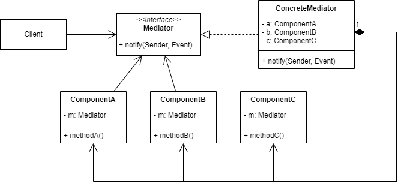

# 中介者模式
## 1.概念
是一种行为设计模式，又称 Mediator/控制器/Controller 模式。

## 2.意图
将各个对象互相之间的沟通/控制抽象出来集中到一个 Mediator 中处理，解耦各个业务对象。

## 3.类图示例

如图所示：
* 初始化时由 Client 创建各个 Component，传入 ConcreteMediator 构造函数来构造 ConcreteMediator。
* 使用时由 Client 或者 Component 调用 ConcreteMediator 的 notify 方法，传入触发者和触发事件，让 ConcreteMediator 调用目标 Component 的具体方法。

## 4.适用场景
### 4.1 业务场景
* 一组相关对象互相之间会产生交互控制时，可以考虑中介者模式：
  * 比如传统 web 开发中 service 层的业务对象是可以互相调用的，如果直接对外提供接口，可想而知行为逻辑会很复杂。
  * 这时考虑为每个特定场景添加一个 Controller，由 Controller 对外提供接口，对内协调各 service 的互相调用。

### 4.2 开源实例
* MVC 模式中的 Controller 就是中介者。
* 各种 GUI 框架中也常见中介者模式来协调同一个操作界面下各组件的控制。

## 5.实现细节与技巧
* 中介者的关键是 Mediator 接口的方法，通常用一个方法（发送者和触发事件作为参数）就能触发所有成员的功能。
* Component 中最好包含 Mediator 成员，方便在执行功能时自行通过 Mediator 触发其他 Component 的方法。

## 6.优缺点
优点：
* 符合单一职责原则，将组件之间的调用抽象到一处。
* 符合开闭原则，ConcreteMediator 对修改关闭，可以新增新的 ConcreteMediator 完成新的控制操作。
* 可以减少 Component 间的耦合。
* 可以复用 Component。

缺点：
* 如果抽象过于集中，Mediator 可能演变为上帝对象。

## 7.与其他设计模式的关系
