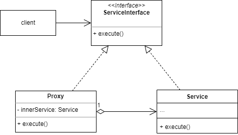

# 代理模式
## 1.概念
代理模式是一种结构型设计模式，又称 Proxy。代理模式就像字面上的意思，提供一个目标对象的替身来控制对目标对象的访问。

## 2.意图
代理的目的就是让用户在不直接接触/使用目标对象的前提下使用目标对象的功能，可以：
* 更好的管理目标对象生命周期。
* 做一些安全加固。
* 远程调用。

## 3.类图示例

## 4.适用场景
### 4.1 业务场景
* 代理 connector 对象，做鉴权。

### 4.2 开源实例
jdk：
* java.lang.reflect.Proxy
* RMI 包

spring：
* AOP 默认是由动态代理实现的，基本原理就是为每个 bean 生成一个代理对象，通过在代理对象中在原对象方法前后加入切点来实现 AOP。

## 5.实现细节与技巧
* 最好能找到现成的service 接口。
* 如果没有现成的接口，又不能修改 service 对象，可以让 proxy 继承 service，即用子类来做 proxy。
* 大部分时候在 proxy 中创建和管理 service 对象的生命周期。少数情况下可能会让用户自行创建并在构造 proxy 时传入 service 对象。

## 6.优缺点
优点：
* 符合开闭原则。
* 由 proxy 管理 service 生命周期从而获得了更好的灵活性，即使 service 还未初始化好，proxy 仍然可用。

缺点：
* 因为可能在 proxy 中使用懒加载，所以服务响应可能会有延迟。
* 服务调用多了一层代码，如果代码组织不够清晰可能会造成混乱。

## 7.与其他设计模式的关系
### 7.1 与装饰模式
共同点：
* 都是内部封装目标对象。
* 都是和目标对象实现相同的接口。

不同点：
* 装饰模式只负责增强目标对象的功能，目标对象的生命周期还是由调用者管理。
* 代理模式需要同时负责目标对象的生命周期管理，调用者只需要管理代理对象。
