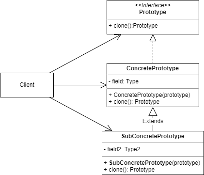

# 原型模式
## 1. 概念
Prototype 又称 Clone，顾名思义是复制已有对象生成新对象的创建型模式。

## 2. 意图
当已有一个现成的对象，可以用原型创建一个和当前对象完全相同的新对象。

## 3. 类图示例
基础原型：

原型注册表：

原型注册表更符合原型模式的使用场景：
* 预先创建一些对象原型并存储在哈希表中。
* 如果需要创建对象直接通过 Type 查询对应的原型 clone 就可以获取和原型完全一样的新对象。

## 4. 适用场景
### 4.1 业务场景
* 需要创建大量相同对象时，不用重复调用构造器，可以使用原型模式：
  * 预置一个原型对象
  * clone这个原型对象生成新的对象
* 对象深拷贝

### 4.2 开源实例
JDK 中：
* java 语言的顶层类中就有 clone 方法，可以说天生就支持原型模式

## 5. 实现细节和技巧
* 一般是重载一个以当前类对象本身为参数的构造函数，在构造函数中复制对象数据。
* clone 方法中用 new 操作符创建新对象，但是调用的是重载的构造函数，同时注意需要显式调用本类的构造函数。
* 如果需要创建的原型很多可以中心化原型注册表，通过一个哈希表管理可以使用的原型。

## 6. 优缺点
优点：
* 可以预置原型对象，避免反复初始化。
* 如果对象本身很复杂，初始化步骤很多，也可以通过层层clone简化生成对象的操作。

缺点：
* 原型模式很难处理复杂对象内部存在循环引用。

## 7. 与其他设计模式的关系
