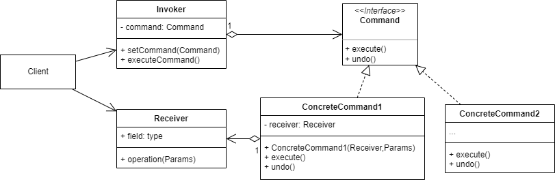

# 命令模式
## 1.概念
命令模式是一种行为设计模式，又称 Command/动作/Action/事务/Transaction 模式。

## 2.意图
将"请求"这一动作封装成命令对象，便于将方法参数化、后续延迟使用队列，甚至可以在某些情况下撤销请求操作。

## 3.类图示例

如图，其中：
* command 接口的实现类都是命令对象，有的命令会调用 receiver 完成具体操作。
* receiver 是命令的接收者，实际上通常是命令实际执行的地方。
* invoker 是命令调用者、发送者，对请求进行初始化，并调用/触发相应的命令。

## 4.适用场景
### 4.1 业务场景
* 需要参数化方法的时候都可以使用命令模式：
  * 实现工作流时，就是将每一个 job 参数化作为命令对象，前端组装工作流时反映到后端就是将命令对象组装成一个复杂的工作流对象。
  * 可以将最终的流对象序列化为json字符串或者xml文件，持久化下来等待实际使用。
  * 最后业务中实际使用流对象时，由调用者反序列化工作流，根据传入的请求触发命令。

### 4.2 开源实例
java语言的线程就是典型的命令模式，创建的线程都是一个个 task，可以单独执行，也可以放到线程池队列中等待执行。
* java.lang.Runnable

## 5.实现细节与技巧
* 有时候需要回滚命令，有两种实现方式：
  * 将回滚也作为命令，同时维护一个已触发的命令栈，调用回滚的时候从栈中取出栈顶命令并恢复 receiver 状态。
  * 将 undo 添加到命令接口，使每个可回滚的命令实现 undo 方法，要回滚时依次调用要回滚的命令的 undo 方法。
* 整体的逻辑表现为 invoker 触发 command，由 command 调用 receiver。

## 6.优缺点
优点：
* 符合单一职责原则，命令触发和命令执行被解耦到两个类中进行。
* 符合开闭原则，invoker 和 receiver 都不需要修改，只需要增加新的 command 类即可。
* 可以持久化一系列复杂操作。
* 可以方便地实现回滚/撤销操作。

缺点：
* 在 invoker 和 receiver 之间增加了一系列 command，大大增加了代码的复杂程度。

## 7.与其他设计模式的关系
