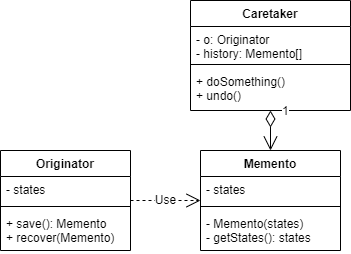

# 备忘录模式
## 1.概念
是一种行为设计模式，又称 Memento/快照/Snapshot。

## 2.意图
在不暴露内部实现的前提下，保存和恢复对象在操作之前的状态。

## 3.类图示例
根据语言特性可以分为两种实现：
### 3.1 内部类

其中 Memento 是 Originator 的内部类，且内部方法和成员全部为私有：
* Caretaker 只能存储  Memento 对象，不能访问 Memento 的成员和方法。
* 在需要恢复状态时，将 Memento 传入 Originator 的 recover 方法，这样因为是自己的内部类， Originator 可以访问 Memento 内部的成员和方法，重新设置状态。

### 3.2 中间接口

其中 Caretaker 只和 Memento 交互，恢复状态时调用 Memento 自己的 recover 方法，通过内部对应 ConcreteOriginator 的设置状态的方法恢复对应状态。

## 4.适用场景
### 4.1 业务场景
* 任何需要记录当前操作步骤并可以撤销操作的业务逻辑都可以使用备忘录。

### 4.2 开源实例
JDK 中所有 java.io.Serializable 接口的实现都可以用作备忘录。

## 5.实现细节与技巧
* 关键点是封装 Originator 类的内部实现，不让其他类获取/查看其内部的成员变量和状态，这一点最好通过内部类配合 private 方法实现。
* 另一个关键点是 Memento 的状态不可变，所以经常是 final 修饰的，内部状态是也是 final，只有创建时通过构造函数才能初始化状态。

## 6.优缺点
优点：
* 可以在不破坏 Originator 封装性的前提下管理它的快照对象。
* 将历史记录从 Originator 独立出来，减少 Originator 对象的复杂性和大小。

缺点：
* 很多动态语言都无法确保 Memento 中的状态不改变，比如 JavaScript/Python/PHP 等。
* 如果状态对象很大，或者 Memento 创建过多，可能占用大量的内存。

## 7.与其他设计模式的关系
