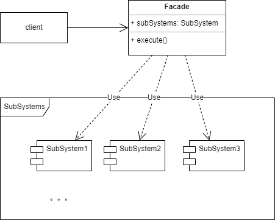

# 外观模式

## 1.概念

外观模式是一种结构性设计模式，又称 Facade/门面模式。为一堆复杂的功能或者整个程序库提供一个简单的对外接口。

## 2.意图

如果在自己的代码中要使用另一个类库提供的某个功能，需要自行初始化这个类库中各种对象，并按说明书给出的顺序执行对象中方法，实际只用了一小部分功能，却要学习/管理一整个复杂的代码库。

而外观模式通过将用户真正关心的核心功能整合起来，并提供一个统一的简单接口，完成对整个第三方类库的使用。

## 3.类图示例

## 4.适用场景

### 4.1 实际业务

* 对称加解密是一个复杂的过程，中间要初始化 Cipher/向量/密钥，还要通过一系列操作最终才能将指定数据加解密，而这些中间操作用户不需要了解，也不需要懂得如何初始化，核心诉求只是对称加解密。那么通过使用外观模式：
  * 对外只提供一个加密接口和一个解密接口，用户只需要提供需要加/解密的 byte 数组即可使用。
  * facade 类中缺省提供了 AES-256-GCM 的加密模式，产品安装时通过自动化脚本生成了初始密钥组件，对一般用户可直接使用，有特殊要求的用户也可以自行定制算法和初始密钥。

### 4.2 开源实例

* 各种工具类库都是这么个思路，比如我用过的几个视频/音频转码工具，都是对外提供一个命令行工具或者干脆就是一个命令，直接把目录下的对象文件进行转码封装，不需要对音视频处理类库有深入的了解。

## 5.实现细节和技巧

* 使用外观模式的前提是用户只使用一个庞大框架/类库的**小部分**特定功能。
* 外观模式的目的是解耦用户代码和子系统/类库代码，如果外观的存在可以让两者独立修改而不会互相影响，那就是成功的。
* 外观类本身应该是简单的，如果外观类自身变得复杂和过于臃肿，那可以考虑将部分行为抽象成新的另一个外观。

## 6.优缺点

优点：

* 符合最少知识原则，用户只需要了解和使用核心功能。
* 能将简单应用和复杂子系统分开独立。

缺点：

* 外观类随着程序迭代开发可能成为危险的**上帝对象**。

## 7.与其他设计模式的关系

