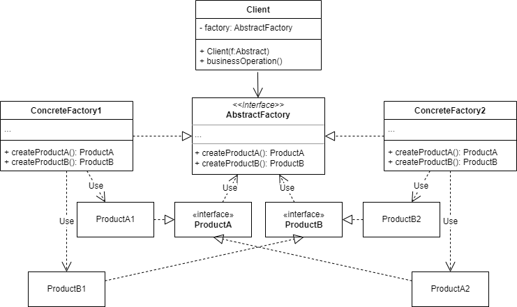

# 抽象工厂
## 1. 概念
`Abstract Factory` 是一种`创建型模式`，用来创建一系列相关的对象。

## 2. 意图
提供一个接口/抽象类，用于创建一组互相有关联的对象家族（多个对象）。

## 3. 类图示例

如图：
* Client：业务逻辑实现的代指，使用 AbstractFactory 创建需要的一系列对象。
* AbstractFactory：抽象工厂本身真的是一个抽象类/接口，一般不负责具体的业务逻辑，只提供一系列抽象对象的创建接口。
* ProductA/ProductB：抽象产品，是构成一系列产品的一组不同但相关（这里相关可以简单理解为一系列，比如椅子和沙发同属家具这一系列）的产品声明接口。
* ConcreteFactory1/ConcreteFactory2：创建具体产品对象的工厂实现类，但是返回的类型必须是**抽象**产品，这样才能实现具体产品类型和业务逻辑的解耦。
* ConcreteProductA1/ConcreteProductA2/ConcreteProductB1/ConcreteProductB2：具体产品，图中同一个序号的产品属于同一系列，分为了两个系列的产品组，ConcreteFactory1 负责生产 1 系列产品， ConcreteFactory2 负责生产 2 系列产品。

## 4. 应用场景
* 代码需要与多个不同体系的产品进行交互，比如要用同一组通信协议对接不同的运营商实现。
* 代码中有基于一组工厂方法的类，又包含一些业务逻辑操作，可以把这些工厂方法抽取到独立的抽象工厂类中去。

## 5. 几个名字带“工厂”的创建型模式对比
