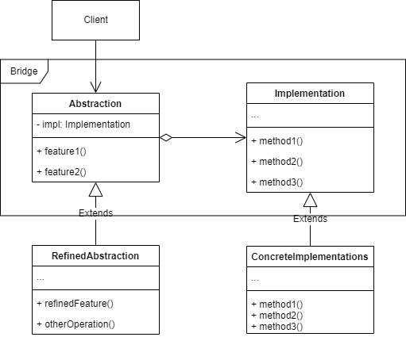

# 桥接模式
## 1. 概念
Bridge 是一种结构型设计模式，将`抽象部分`和`实现部分`分离，可以分别扩展和修改。
* 又称 Handle and Body。
* 这里的`抽象部分` 和 `实现部分`与语言中的抽象类和实现类无关，是业务层面的抽象和实现，对外暴露的是`抽象部分`（即 Handle），内部实际业务逻辑运行的是`实现部分`（即 Body）。

## 2. 解决的问题
* 在抽象层次将一个类的多种独立变化维度关联起来，可以使各个维度独立扩展修改而不会互相影响。

* 减少多层继承导致的子类数量急剧增加。

## 3. 类图示例

类图中涉及5个角色，以遥控器（作为抽象部分）和电器（作为实现部分）为实例来参考说明：
* client：业务代码，基本只和 Abstraction（抽象部分）交互。类比实例的操作者，操作遥控器。
* Abstraction：`抽象部分`的基础抽象，对外提供了基本的操作接口，类比实例的遥控器，对操作者提供基本操作：开机/关机。如果有扩展需要，可以 extends 出更多的 RefinedAbstraction。
* RefinedAbstraction：扩展或者修改了`抽象部分`的逻辑，作用类似 Abstraction。类比实例的特化的具体遥控器，比如空调遥控器，扩展了升高温度/降低温度的操作。RefinedAbstraction 不是一定要有的，只有需要更多`抽象部分`变体的时候才这么做。
* Implementation：`实现部分`的顶层抽象，和`抽象部分`关联，通常是一个抽象类或者接口。类比实例的电器，只提供外观接口，不提供内部实现。`实现部分` 一定有子类扩展：
  * ConcreteImplementations：`实现部分`的子类实现，实现了具体的操作逻辑。类比实例的具体电器，比如空调，可以根据传入参数调整温度。

## 4. 适用场景
### 4.1 实际工作场景
桥接在实际工作中用起来比较复杂，也不是很常用，一般用的话在设计阶段就要考虑桥接模式了：
* 拆分一个拥有很多复杂功能的类，拆出抽象层次和实现层次。
* 如果在运行时需要切换不同的实现方法，也可以使用桥接。

### 4.2 开源实例
JDK 中的 JDBC 实现就是很好的例子。

## 5. 实现细节和技巧
* 设计桥接模式时一定要明确类中的独立维度，否则可能变成为了拆分而拆分，失去了实际意义。这些独立维度可能是：
  * 抽象/平台
  * 前端/后端
  * 域/基础设施
  * 接口/实现
* `抽象部分`和`实现部分`的抽象层次接口很重要，需要在设计之初就考虑可以在所有平台上都执行的业务接口。
* `实现部分`通常由业务代码在创建`抽象部分`时通过构造函数传参与`抽象部分`组装。

## 6. 优缺点
优点：
* 符合单一原则。`抽象部分`专注处理高层逻辑，`实现部分`专注处理平台细节。
* 符合开闭原则。`抽象部分`和`实现部分`都能独立扩展，互相之间不会影响。

缺点：
* 如果在设计之初就是高内聚的类，使用该模式会使代码变得非常复杂。

## 7. 与其他设计模式之间的关系
