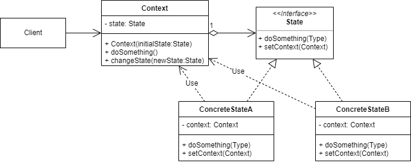

# 状态模式
## 1.概念
是一种行为设计模式，又称 State，和有限状态机紧密相关。

## 2.意图
这种设计模式可以让对象在运行时根据状态改变自己的行为，就像实时更换了实现类一样。

## 3.类图示例

如图所示：
* 用一个 Context 对象存储当前 State 引用，并对外提供功能方法。
* Context 将所有方法都委派给内部的 State 对象。
* State 对象也保存有当前 Context 的引用，此引用用于在处理请求的过程中状态变更时调用 context.changeState 方法更换 Context 对象内部的 State 对象。

## 4.适用场景
### 4.1 业务场景
* BME 中大量使用 Context 管理当前业务请求/前端页面展示的状态，就是使用了状态模式：
  * 业务请求状态用 StateContext 管理，内部包含一个 StateMachine 作为当前状态，通过业务步骤列表中定义的步骤id实时切换当前状态，包含页面跳转/请求返回/异常返回等。
  * 这些步骤列表可以通过编码定制，也可以通过xml配置文件配置。
  * 其他代码可以实时查询 Context 的状态，监控当前业务进行到了哪一步。
* 处理多层的 if...else 语句代码也可以使用状态模式进行解耦。
* 游戏开发中会大量使用状态模式。

### 4.2 开源实例
* spring-statemachine

## 5.实现细节与技巧
* Context 的方法抽象很重要，这决定了之后扩展新状态的难易程度。
* 状态类 State 需要保存一个 Context 的引用，这样可以在状态内部切换其他状态，而不用每次都由调用者来切换状态。

## 6.优缺点
优点：
* 符合单一职责原则，一个状态只处理一种场景的需求。
* 符合开闭原则，新增状态不用修改 Context 和已有的 State 类。
* 可以将 Context 从复杂的逻辑判断中解放出来。

缺点：
* 如果状态只有很少的变化，那么使用状态模式就太臃肿了。

## 7.与其他设计模式的关系
