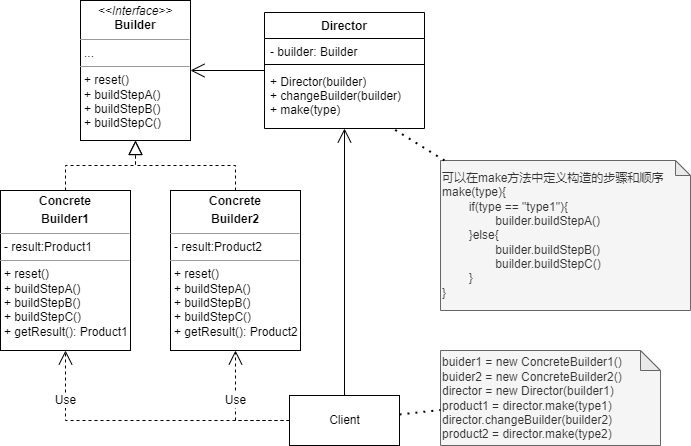

# 生成器模式
## 1. 概念
Builder 是一种创建型模式，主要目的是使用一组定义好的创建步骤创建不同的复杂对象。

## 2. 意图
封装一个复杂对象的构造过程，允许子类/实现类自定义不同的构造步骤。

## 3. 类图示例

如图：
* Builder 接口声明了所有通用的构造步骤。
* ConcreteBuilder1/ConcreteBuilder2 具体的生成器，实现通用的构造步骤，也可以自定义，不使用通用构造步骤，最终通过 `getResult()` 方法返回构造完成的产品。
* Director 主管类用于定义调用构造步骤的顺序，是供 Client 业务逻辑使用的生成器核心类。
* Client 必须指定具体的生成器实现，把它传给 Director 用于按特定步骤构造产品。

## 4. 适用场景
* 当一个对象的构造函数的可选参数特别多时，为了避免重载过多的构造函数，可以使用生成器模式：
  * 只定义必须实现的构造步骤，其他可选的步骤交由子类/实现类来实现。
* 当构造的两种对象仅存在很细微的细节差别时，为了避免完全重写一个构造过程大部分相同的工厂类/构造函数，可以使用生成器模式：
  * 在生成器的接口/抽象类中定义基本的生成步骤和构造过程。
  * 在生成器的子类/实现类中负责具体的差异性细节的构造。
* 当构造的对象特别复杂或者是一个对象组合树时，可以使用生成器模式：
  * 生成的步骤可在子类/实现类中自定义，可以重复或者递归调用某些步骤。
  * 整个对象树/复杂对象生成完成前不会返回，避免业务逻辑使用一个不完整的复杂对象，造成难以定位的问题。

## 5. 与其他设计模式的关系
