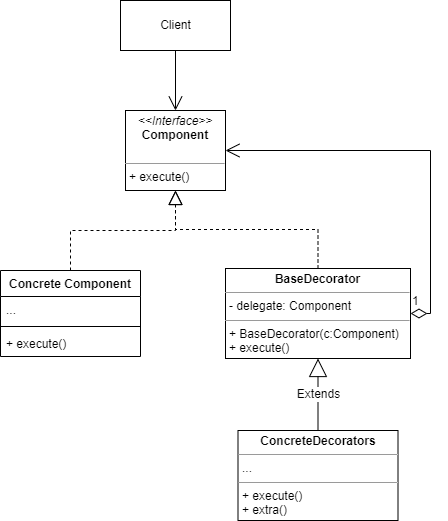

# 装饰模式

## 1.概念

装饰器模式，又称 Decorator/Wrapper，是一种结构型设计模式，顾名思义，是包装在原对象外层的一种设计模式。

## 2.意图

一般有两种方式可以给一个现有的类或对象扩充功能：

* 继承，但是直接继承会有两个问题：
  * 继承是静态的，无法在运行时修改已有对象的行为，只能使用新的对象替代已有对象。
  * 大多数编程语言不支持多继承，子类通常只能有一个父类。
* 聚会或者组合，通过将已有对象封装进自己的对象，并将部分工作委派给已有对象，这样就解决了继承的两个小问题。

表现在装饰模式中：装饰器和被装饰的对象实现同一个接口，装饰器内拥有1个或多个被装饰对象作为成员变量，通过在调用这些成员变量对应方法前/后添加额外的逻辑来完成对已有功能的扩充。

## 3.类图示例

如图：

* BaseDecorator：基础装饰类，用于封装目标对象，并在 execute()方法中直接调用被封装对象相应的方法。
* ConcreteDecorator：具体装饰类，继承自 BaseDecorator，通过重写基类方法在调用 super.execute() 前后添加额外的用于扩展额外的操作。
* Client 先创建对象，然后通过将对象封装成不同的 ConcreteDecorator 对象，最终 Client 用户在使用的是 ConcreteDecorator 。

## 4.适用场景

### 4.1 业务实例

* 扩展一个声明为final的class，不能用继承，就可以使用装饰模式来扩展。
* 想要不修改代码，直接在原有类的基础上添加新功能。

### 4.2 开源实例

* java.io 包下的各种IOStream
* Collections.synchronizedMap/SortedMap/unmodifiedMap 等封装集合

## 5.实现细节和技巧

* 最重要的是先抽象出用户要使用的公用接口/方法。
* 从最基础的被封装对象到最后实际使用的具体装饰器，都是由用户创建的，所以装饰器的构造函数需要能传入被封装的对象。

## 6.优缺点

优点：

* 符合开闭原则
* 符合单一职责原则，每个被封装对象都可以只负责单一功能
* 可以不用继承实现对象功能的扩展

缺点：

* 创建装饰器需要用到基础的被封装对象，使得初始化操作比较繁琐
* 新增功能简单，但是减少功能很困难

## 7.与其他设计模式的关系
