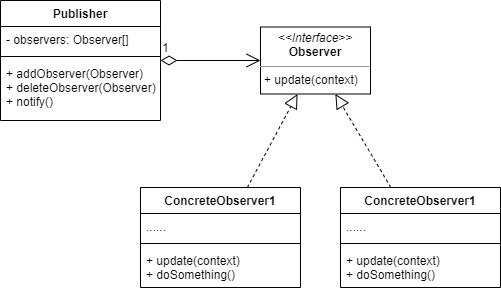

# 观察者模式
## 1.概念
是一种行为设计模式，又称 Observer/事件订阅者/Event-Subscriber。

## 2.意图
通过定义一种订阅机制，在对象事件发生时通知所有订阅者/观察者。

## 3.类图示例

其中：
* Observer 在需要观察时主动通过 addObserver 方法注册到 Publisher 中去。
* 当触发某种事件时，需要调用 Publisher 的 notify 方法，此方法中通过调用 Observer 的 update 方法来通知所有观察者。

## 4.适用场景
### 4.1 业务场景
* 当一个对象状态的改变需要同时修改其他多个对象的状态时就需要使用观察者模式，比如：
  * GUI 编程中常见的点击一个按钮，需要联动界面变动/其他控件状态修改/具体业务功能触发。
* 常见的告警系统功能都是观察者模式实现的，比如：
  * 系统 cpu/内存 使用量超过阈值，可以发布告警事件，程序的其他组件订阅这个事件，在触发时给管理者发邮件/记录告警日志/服务降级等。

### 4.2 开源实例
* java.util.EventListener

## 5.实现细节与技巧
* 订阅者唯一的共同点就是实现了 Observer 接口，其内部的实现互相之间可以毫不相关。
* 发布者通常是核心功能类，在 开始/完成 某些特定操作时通过 Observer 接口通知所有的订阅者。
* 如果订阅者太多或者订阅者本身被通知后要执行的操作比较复杂，可以在订阅者内部用异步的方式实现具体功能。

## 6.优缺点
优点：
* 符合开闭原则，增加新的订阅者不需要修改发布者的代码。
* 可以在运行时实时增加/减少订阅者。

缺点：
* 如果用异步的方式实现订阅者，那么通知触发订阅者的顺序就不一定了。

## 7.与其他设计模式的关系
