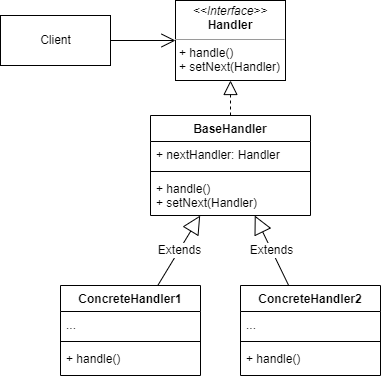

# 责任链模式
## 1.概念
责任链模式是一种行为设计模式，又称命令链/chain of responsibility，将请求沿链传递，链上的每个成员都能处理请求。

## 2.意图
将请求的处理者连成一个链条，后续逻辑可以分为两种模式：
* 处理者判断是否是自己处理的请求，不是就原样传递给下一个处理者，如果是就自己拦截下来处理。类似 servlet filter。
* 每个处理者都处理一遍请求，不符合要求就中断请求直接返回。类似校验器类。

## 3.类图示例

图中 BaseHandler 是可选的，为了代码结构简洁可以不使用，直接从 Handler 接口实现具体的处理器。

## 4.适用场景
### 4.1 业务场景
* web 开发中常见的 filter/validator 都是责任链模式的实现。
* 之前做计费项目时，计费的前置条件/预处理参数也是使用责任链模式实现的：
  * 初始的计算参数对象通过条件处理器，将系统/区域/分公司配置的额外条件和参数整合进去。
  * 这些配置的额外条件和参数在代码中都体现为实现了 handler 接口的具体处理器，通过回调函数注册到责任链中。

### 4.2 开源实例
## 5.实现细节与技巧
## 6.优缺点
## 7.与其他设计模式的关系
