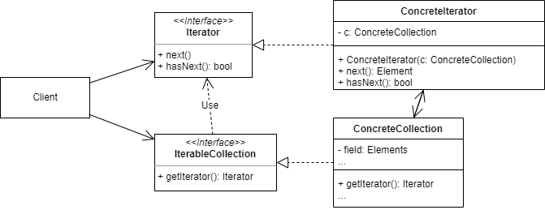

# 迭代器模式
## 1.概念
是一种行为设计模式，又称 Iterator。

## 2.意图
目的是提供一种外部可用的按顺序访问聚合对象内部成员的方法，但是不暴露聚合对象的内部实现。常见于集合操作。

## 3.类图示例

如图所示，其中：
* client 先持有 Collection，在需要迭代访问内部元素时调用该 Collection 的 getIterator 方法获取/创建 Iterator 来使用。

## 4.适用场景
### 4.1 业务场景
* 如果可以预见业务场景会使用不同的内部数据结构，可以使用迭代器模式，以计费为例：
  * 一个聚合计费项内部可能是数组/树等不同的数据结构。
  * 想这个聚合计费项收取税费时需要遍历判断每个子元素是否需要收取税费，这时如果使用了迭代器就会很容易遍历。

### 4.2 开源实例
jdk 中的集合类和枚举类就是典型的迭代器实现。
* java.util.Iterator
* java.util.Enumeration

## 5.实现细节与技巧
* 如果有需要双向迭代，可以在 Iterator 接口中添加 prev 方法，访问前一个元素。
* 在聚合类内部创建 Iterator 时可以每调用一次方法创建一个，这样可以隔绝迭代器之间的影响。
* 如果要更灵活地遍历，可以再添加一个 getIndex 方法，每一步迭代都可以记录当前迭代的位置，方便暂停和继续。

## 6.优缺点
优点：
* 符合单一职责原则。
* 符合开闭原则。
* 可以并行遍历而不会互相影响顺序。

缺点：
* 如果遍历对象是可以确定内部数据结构的聚合类，增加 Iterator 可能毫无帮助，且会增加不必要的冗余。
* 有的集合直接遍历可能比使用迭代器效率更高。

## 7.与其他设计模式的关系
