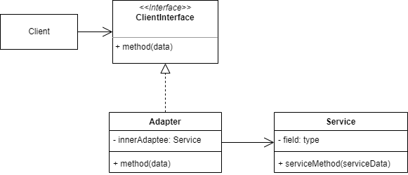

# 适配器模式
## 1. 概念
Adapter 又称封装器模式，是一种结构型设计模式，目的是使接口不兼容的对象能互相适配。

## 2. 意图
封装复杂的对象转换过程，甚至可以通过实现业务逻辑接口的方式来隐藏适配器自身的存在(即业务代码无法感知适配器的存在)。

## 3. 类图示例
可以通过适配的层次不同分为两种：

1、 对象适配器

adapter 在实现时使用了构成原则：
 * 适配器直接实现了业务对象的接口，把自己作为业务对象实例。
 * 适配器内部封装了另一个 Service 对象，这个 service 对象才是需要适配的实现了实际功能的对象。

2、类适配器

类适配器使用了继承机制：
 * adapter 同时继承两个不兼容的对象。
 * 在 adapter 中重写的方法里直接进行适配。

这种方式有一个局限性，只能在支持多重继承的语言中才能实现，比如 C++。

## 4. 适用场景
### 4.1 实际业务场景
* 两个系统对接，一个系统产生的数据格式不能直接被另一个系统使用，比如某个系统导出的分析数据是 xml 格式的，另一个系统是使用excel文件进行分析的，可以使用适配器模式：
  * 创建一个 xml-excel 适配器，内部实现 xml 和 excel 格式互转。
  * 也可以直接适配分析代码，创建一个 xml 适配器，直接和分析业务的代码对接，不经过 excel 转换。
* 在业务扩展过程中，可能出现一系列新的对象，他们都统一提供了某种额外的功能，如果直接扩展需要改动所有使用了这类对象的代码，这时也可以使用适配器模式：
  * 将额外扩展的功能放到适配器中，这样其实更像装饰器模式。

### 4.2 开源实例
JDK 中：
* java.util.Arrays#asList()
* java.util.Collections#list()

各种bean映射转换器：
* mapstruct
* dozer（已经基本不更新了）

## 5. 实现细节和技巧
* 只对确实不兼容且难以修改的接口使用适配器模式，如果目标对象代码是可以修改的，可能在目标对象里直接添加接口更容易一些。
* 最好是业务代码通过接口来使用适配器，这需要平时就养成使用接口解耦代码的好习惯。

## 6. 优缺点
优点：
* 符合单一职责原则。数据/接口转换的代码与主要业务解耦。
* 符合开闭原则。只要业务代码通过接口和适配器交互，那么就可以随意扩展适配器而不影响现有业务代码。

缺点：
* 增加代码层次和数量，有时候直接新增转换方法更快速便捷。

## 7. 与其他设计模式的关系
