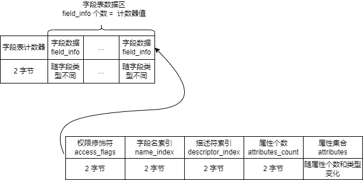
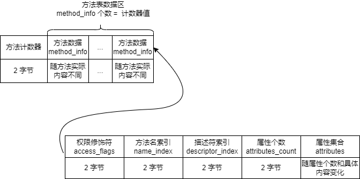

# Class 文件结构
JVM 直接使用的是字节码，其文件形式就是 .class 文件。

例如编写一个示例类：
```
public class SimpleClassByteCodeTest {
    private int valueA = 3;

    protected long valueB = 1551L;

    public boolean valueC = true;

    Object valueD = new Object();

    private static double valueE = 3.14d;

    private double calculate(int paramF){
        int temp = 2;
        int valueG = temp + paramF + valueA;
        if(valueC){
            System.out.println(valueD.toString());
        }
        return valueE * valueG;
    }
}
```
使用 javac 编译后得到如图所示的字节码：


这个文件的内容结构在 JVM 规范中是有严格规范的，从头到尾的结构依次为：


接下来对每个部分一一进行分析。

## 1. 魔数（Magic）
所有 `.class` 文件的前 4 个字节都是魔数，而且这个魔数是固定值，为 `0xCAFEBABE`。

魔数的唯一作用就是确定这个文件是否是能被 JVM 接受的 class 文件。

## 2. 版本号
魔数后的 4 个字节表示版本号。

* 前 2 个字节表示次版本号（Minor Version）
* 后 2 个字节表示主版本号（Major Version）

比如上图中的版本号为 `00 00 00 34`，表示该 class 文件由 1.8.0 版本的 java 编译器编译。

## 3. 常量池（Constant Pool）
版本号后是一块常量池，这个常量池的长度由内容决定，不是定长的。

常量池内部结构如下，主要分为计数器和常量池数据区两大部分:


以下描述计数器值为 `constant_pool_count`。

### 3.1 常量池计数器
固定 2 字节大小，从 1 开始计数。意思是如果常量个数为 0，则 `constant_pool_count == 1`。

### 3.2 常量池数据区
由 `constant_pool_count - 1` 个 cp_info 结构组成，一个 cp_info 对应一个常量，但是每种 cp_info 的结构各有不同。

在 JDK 8 的虚拟机规范中定义了 14 种常量类型，如下表所示：


常量池数据比较复杂，可以使用反编译工具一次性查看所有常量池数据。

比如 java 可以使用：
* `javap -verbose <classname>`命令
* idea 中的 `jclasslib` 插件

## 4. 访问标志（Access Flags）
常量池数据区后紧跟的 2 个字节表示访问标志。

访问标志用于定义类的访问权限以及类的类型（例如是接口/enum还是注解？），一共有 16 个标志位可用（因为 2 字节占 16位二进制），但是JDK 8 的虚拟机规范中只指定了 8 种标志位（其他未指定值一律为 0）：

|标志名称|值|含义|
|---|---|---|
|ACC_PUBLIC|0x0001| 是否为 public 修饰|
|ACC_FINAL|0x0010| 是否为 final 修饰|
|ACC_SUPER|0x0020| 是否使用 invokespecial 指令的新语义，JDK 1.0.2 之后版本编译出来的类必须包含此标志|
|ACC_INTERFACE|0x0200| 是否是一个接口|
|ACC_ABSTRACT|0x0400| 是否为 abstract，java 中只有接口和抽象类包含这个标志|
|ACC_SYNTHETIC|0x1000| 有这个标志表示此类不是由用户代码产生|
|ACC_ANNOTATION|0x2000| 是否是一个注解类|
|ACC_ENUM|0x4000|是否是一个枚举类|

这些标志位之间通过位或（|）来决定最终访问标志值，比如 `00 11` 表示 `public final`，即 `0x0001 | 0x0010 = 0x0011`。

## 5. 当前类索引（this class）
访问标志后紧跟的 2 个字节是当前类的索引。值是一个索引值，指向当前类的全限定名在常量池中的位置，通过这个索引可以获取常量池中定义的全限定名。

## 6. 父类索引（super class）
当前类索引后紧跟的 2 个字节是父类索引，同上，值也是一个索引值，指向父类的全限定名在常量池中的位置。

## 7. 接口信息（interface）
父类索引后紧跟的是接口信息，这是 `接口计数器 + 一组接口索引`：
* 前 2 字节是接口计数器，和常量池计数器**不同**，从 `0` 开始计数，记为 `interface_count`
* 后 `interface_count * 2` 个字节就是每一个接口的索引，和其他索引一样，值是指向接口全限定名在常量池中的位置

## 8. 字段表（fields）
接口索引后紧跟的是字段表区域，这一区域也是不定长的，总体分为两个部分，字段表计数器和字段表数据区：



最后的属性表会出现在很多地方，就留到最后和文件的属性表一起分析。

### 8.1 字段修饰符（access_flags）
和类的访问标志类似，也是一个 2 字节的数据，通过不同标志的位或（|）来计算最终值，标志值和含义如下表所示：
|标志名称|值|含义|
|---|---|---|
|ACC_PUBLIC|0x0001| 是否为 public|
|ACC_PRIVATE|0x0002| 是否为 private|
|ACC_PROTECTED|0x0004| 是否为 protected|
|ACC_STATIC|0x0008| 是否为 static|
|ACC_FINAL|0x0010| 是否为 final|
|ACC_VOLATILE|0x0040| 是否为 volatile|
|ACC_TRANSIENTE|0x0080| 是否是 transient|
|ACC_SYNTHETIC|0x1000| 有这个标志表示此字段不是由用户代码产生而是编译器自动生成的|
|ACC_ENUM|0x4000|是否是一个枚举类型|

### 8.2 字段名称（name_index）
字段修饰符后紧跟的 2 个字节为字段名称索引，这里索引值指向的是该字段在常量池中对应的简单名称。

简单名称指没有类型和参数修饰的名称，比如本文示例代码类中第一个字段的简单名称为 `valueA`。

### 8.3 描述符（descriptor_index）
字段名称后紧跟的 2 个字节为描述符索引，这里索引值指向的是该描述符在常量池中对应的标识字符。根据类型不同，分为以下 11 类：
|标识字符|含义|
|---|---|
|B|基本类型 btye|
|C|基本类型 char|
|D|基本类型 double|
|F|基本类型 float|
|I|基本类型 int|
|J|基本类型 long|
|S|基本类型 short|
|Z|基本类型 boolean|
|V|特殊类型 void|
|L|对象类型，后面跟类全限定名，如 Ljava/lang/Object|
|\[|数组类型，几维数组就有几个 `[`，后面再跟数组元素的标识字符，如 `int[][]` 类型就是 `[[I`|

## 9. 方法表（methods）
字段表后紧跟着方法表，也是不定长，由两部分组成，方法计数器和方法表数据区：



最后的属性表会出现在很多地方，就留到最后和文件的属性表一起分析。
### 9.1 权限修饰符（access_flags）
和类的访问标志及字段权限修饰符类似，也是一个 2 字节的数据，通过不同标志的位或（|）来计算最终值，标志值和含义如下表所示：
|标志名称|值|含义|
|---|---|---|
|ACC_PUBLIC|0x0001| 是否为 public|
|ACC_PRIVATE|0x0002| 是否为 private|
|ACC_PROTECTED|0x0004| 是否为 protected|
|ACC_STATIC|0x0008| 是否为 static|
|ACC_FINAL|0x0010| 是否为 final|
|ACC_SYNCHRONIZED|0x0020| 是否为 synchronized|
|ACC_BRIDGE|0x0040| 是否为编译器产生的桥接方法|
|ACC_VARARGS|0x0080| 方法是否接受不定参数|
|ACC_NATIVE|0x0100| 是否是 native|
|ACC_ABSTRACT|0x0400| 是否是 abstract|
|ACC_STRICTFP|0x0800| 是否是 strictfp|
|ACC_SYNTHETIC|0x1000| 有这个标志表示此方法不是由用户代码产生而是编译器自动生成的|
