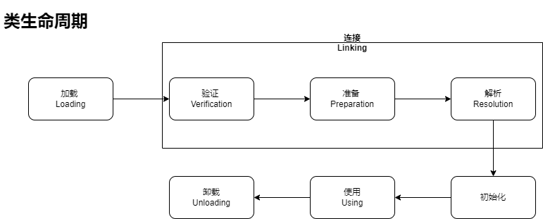
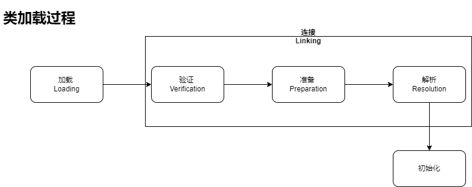

# 类加载机制
## 1. 概述
区别于其他在编译时需要进行连接工作的语言，Java 的类型加载、连接、初始化过程都是在运行时完成的。

虚拟机把描述类的数据从 class 文件（不一定是磁盘文件，只要是能输入的二进制流都行）加载到内存，并对数据进行校验、转换解析和初始化，最终形成可以被虚拟机直接使用的 Java 类型，这就是类加载。

在虚拟机中类的生命周期如下：


这些阶段除了 `解析` 以外都是按顺序开始的，但不一定按顺序完成，比如可能类还没完成 `加载`，就已经开始 `验证` 了，这些阶段通常是互相交叉进行的。

## 2. 类加载的时机
虚拟机规范没有规定 `Loading` 阶段执行的时机，但是强制规定了 `Initialization` 阶段的执行时机，即有且仅有在 6 种主动引用类的情况下，必须进行 `Initialization`。

可以使用：
> -XX:+TraceClassLoading

参数来观察类加载的实际情况。也可以通过在类的静态域添加 print 方法来判断该类是否执行了初始化。

### 2.1 主动引用
主动引用在规范中有且仅有 6 种情况：
* 遇到 new、getstatic、putstatic、invokestatic 这 4 条字节码指令的任意一条时，如果目标类没有进行初始化，则会先触发初始化。
* 使用 java.lang.reflect 包的方法对目标类进行反射调用时，如果目标类没有进行初始化，则会先触发初始化。
* 进行一个类的初始化时，如果该类的父类没有进行初始化，则会先触发其父类的初始化。
* 虚拟机启动时，用户指定执行的主类（即 main 方法所在的类）会先触发初始化。
* 使用动态语言支持时，MethodHandle 和 VarHandle 调用前需要使用 `findeStaticVarHandle` 来初始化目标类。
* JDK 8 之后如果在接口中定义了 default 方法，在其实现类初始化之前需要先对接口进行初始化。


### 2.2 被动引用
除了以上 6 种强制初始化的情况，其余情况都是被动引用，不用强制执行初始化。

## 3. 类加载过程
类加载总体分为 5 个阶段，加载、验证、准备、解析、初始化。其中验证、准备、解析可以统称为 `连接`。


### 3.1 加载（Loading）
加载阶段是类加载过程的第一步，主要完成以下 3 件事：
1) 通过类的全限定名来获取此类的二进制字节流。
2) 将这个字节流所代表的静态存储结构转换为方法区的运行时数据结构。
3) 在内存中生成一个代表这个类的 `java.lang.Class` 对象，作为方法区这些数据的访问入口。

以上 3 点都没有具体的描述，实际实现方式和应用都很灵活。

利用这些灵活性，我们可以定制加载阶段的具体实现，比如自定义获取二进制流的过程，可以从网络上来，也可以从加密后的文件解密得来，也可以在运行时计算生成。

### 3.2 验证（Verification）
验证阶段的目的是确保 Class 二进制流中包含的信息符合虚拟机的要求，同时保证其内容不会危害虚拟机的安全。

总体上看，此阶段大致会完成以下 4 个校验动作：
1) 文件格式验证
验证字节流是否符合 Class 文件格式的规范。比如以下验证点：
* 是否以 `0xCAFEBABE` 开头
* 主、次版本号是否在当前虚拟机的处理范围内
* 检查常量 tag 标志，是否存在不被支持的常量类型

。。。等

2) 元数据验证
验证字节码描述信息，保证其符合 Java 语言规范的要求。比如以下验证点：
* 这个类是否有父类
* 如果这个类不是抽象类，是否实现了接口和其父类要求实现的所有方法

。。。等

3) 字节码验证
通过数据流和控制流分析，确保程序语义是合法的、符合逻辑的。比如：
* 保证跳转指令不会跳转到方法体以外的字节码指令上
* 保证方法体中的类型转换是有效的

。。。等

4) 符号引用验证
这部分的验证发生在 `解析` 阶段中，目的是保证符号引用转换为直接引用的解析操作能正常进行。

### 3.3 准备（Preparation）
正式为 `类变量` 分配内存并设置 `类变量初始值` 的阶段。

有以下注意点：
1) 这里的初始值通常情况是指 `零值`。比如定义了 
```
private static int value = 128;
```
准备阶段设置的初始值为 `0` 而不是 `128`。以下给出零值列表：
|数据类型|零值|
|---|---|
|int|0|
|long|0L|
|short|0|
|char|'\u0000'|
|byte|0|
|boolean|false|
|float|0.0f|
|double|0.0d|
|reference|null|

2）特殊情况：当类字段的字段属性表中存在 `ConstantValue` 属性时，那么在准备阶段会将字段设置为 `ConstantValue` 指定的值。比如将上一个类变量定义改为：
```
private static final int value = 128;
```
添加了 final 关键字，编译时 Javac 会为 `value` 生成 `ConstantValue` 属性且指定为 `128`，那么准备阶段就会设置初始值为 `128`。

### 3.4 解析（Resolution）
前面符号引用验证时提到过，解析阶段的目的是将常量池中的 `符号引用` 替换为 `直接引用`。

### 3.5 初始化（Initialization）
初始化目的是执行初始化方法 `<clinit>()`，是类加载的最后一个阶段，这一阶段才会真正开始执行 Java 程序中定义的代码。

`<clinit>()` 方法是由编译器自动收集类中的所有类变量的赋值动作和静态语句块（即 static{} 块）中的语句合并产生的，不是类的构造函数 `<init>()`。

初始化过程有以下特点：
* 虚拟机会保证类的父类的 `<clinit>()` 在子类 `<clinit>()` 方法执行前完成，所以虚拟机中第一个执行的 `<clinit>()` 方法一定是 `java.lang.Object` 类的。
* 由于 `<clinit>()` 的顺序固定，所以父类的静态语句块一定先于子类的静态语句块执行。
* `<clinit>()` 方法对于类和接口来说不是必须的，如果一个类没有静态语句块，也没有对类变量的赋值操作，那么编译器可能不会为其生成 `<clinit>()` 方法。
* 接口中的 `<clinit>()` 方法用于给变量赋值，且不需要先执行父接口的 `<clinit>()`，除非父接口定义的变量被接口使用；另外接口的实现类在初始化时也不会先执行接口的 `<clinit>()` 方法，除非接口定义的变量被实现类使用。
* 虚拟机会保证 `<clinit>()` 方法的执行是线程安全的，如果同时有多个线程初始化同一个类，那只有一个线程会执行 `<clinit>()` 方法，其他线程都会阻塞。需要注意 `<clinit>()` 只会执行一次，所以其他线程唤醒后不会再执行 `<clinit>()`。

## 4. 类加载器
类加载的第一个阶段 `加载` 中有一个动作：“通过一个类的全限定名来获取描述此类的二进制字节流”。这个动作被放到虚拟机外实现，可以让应用程序自己决定如何获取所需的类，实现这个动作的代码模块称为`类加载器`。

### 4.1 从虚拟机角度
对虚拟机来说，类加载器只有两类：
* 一类是启动类加载器（Bootstrap ClassLoader），对于 HotSpot 虚拟机来说这个类加载器由 C++ 实现。
* 另一种就是其他类加载器，全部都是由 Java 语言实现，独立于虚拟机，且都继承自 `java.lang.ClassLoader` 抽象类。

### 4.2 从实现角度
从开发人员角度看，类加载器可以细分为 4 种：
* 启动类加载器（Bootstrap ClassLoader）：负责加载存放在 `<JAVA_HOME>\lib` 目录中，或者 `-Xbootclasspath` 虚拟机参数指定的路径中的类库（而且文件名必须能被虚拟机识别）。这个类加载器最特殊，无法被java 程序代码直接引用，一般在运行时调用 Class 的 `getClassLoader()` 方法，如果返回值是 null，说明该类就是由 `Bootstrap ClassLoader` 加载的。
* 扩展类加载器（Extension ClassLoader）：负责加载 `<JAVA_HOME>\lib\ext` 目录中，或者 `java.ext.dirs` 系统变量指定的路径中的类库。这个类加载器由 `sun.misc.Launcher.ExtClassLoader` 实现，没有启动类加载器的限制，可以加载路径下所有的类库，而且是 java 代码实现可以直接引用，因此开发者可以在代码中直接使用此类加载器。
* 应用程序类加载器（Application ClassLoader）：负责加载用户类路径（ClassPath）指定的类库。由 `sun.misc.Launcher.AppClassLoader` 实现，开发者也可以在代码中直接使用这个类加载器。正常情况下，如果没有特别指定其他类加载器，应用程序代码使用的就是这个类加载器。
* 用户自定义类加载器（User ClassLoader）：用户自定义实现的类加载器。一般继承自 `java.lang.ClassLoader` 抽象类，通过重写 `findClass()` 方法实现用户自定义的功能，比如字节码加解密、字节码增强功能等。

### 4.3 Parents Delegation Model （双亲委派模型）
上文讨论的类加载器之间的层次关系大致如下：


如图这种类加载器的层次关系称为 `Parents Delegation Model`，模型要求除了 `Bootstrap ClassLoader` 外所有类加载器都需要有自己的父类加载器。

这个模型并不是强制要求，而是一种推荐的类加载器实现方式。

Parents Delegation Model 的工作流程可以从 `java.lang.ClassLoader#loadClass(java.lang.String, boolean)` 方法中看出来，以下是 jdk 8 的源代码：
```
private final ClassLoader parent;
protected Class<?> loadClass(String name, boolean resolve)
        throws ClassNotFoundException
    {
        synchronized (getClassLoadingLock(name)) {
            // 首先，检查请求的类是否已经被加载过
            Class<?> c = findLoadedClass(name);
            if (c == null) {
                long t0 = System.nanoTime();
                try {
                    if (parent != null) {//父加载器不为空，调用父加载器loadClass()方法处理
                        c = parent.loadClass(name, false);
                    } else {//父加载器为空，使用启动类加载器 BootstrapClassLoader 加载
                        c = findBootstrapClassOrNull(name);
                    }
                } catch (ClassNotFoundException e) {
                   //抛出异常说明父类加载器无法完成加载请求
                }

                if (c == null) {
                    long t1 = System.nanoTime();
                    //自己尝试加载
                    c = findClass(name);

                    // this is the defining class loader; record the stats
                    sun.misc.PerfCounter.getParentDelegationTime().addTime(t1 - t0);
                    sun.misc.PerfCounter.getFindClassTime().addElapsedTimeFrom(t1);
                    sun.misc.PerfCounter.getFindClasses().increment();
                }
            }
            if (resolve) {
                resolveClass(c);
            }
            return c;
        }
    }

```

这种工作模式保证了 Java 类的优先级关系，确保优先级高的类不会被用户自定义类覆盖或者在一个虚拟机中不会出现多个 `java.lang.Object` 这种系统类。

### 4.4 不遵循 Parents Delegation Model？
例如 OSGi 中的网状结构模型。

## 5. 类卸载
类卸载完成的标志是类的 `Class` 对象被 GC。

类卸载需要满足以下 3 个条件：
* 该类的所有实例对象都已经被回收。
* 该类没有在任何除自己以外的地方被引用。
* 该类的类加载器实例已经被回收。
