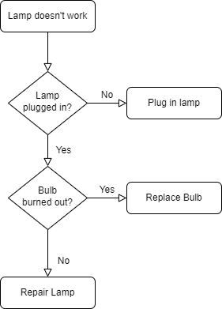

# AQS(Abstract Queued Synchronizer)
## 1. 核心思想
* 如果被请求的共享资源空闲

将当前请求资源的线程设置为当前工作线程，并将共享资源加锁。

* 如果被请求的共享资源被占用

将暂时获取不到锁的线程放入队列中等待解锁时唤醒，这个队列在 AQS 中是一个 CLH 队列。
AQS 将每个请求资源的线程封装成一个 Node 放入 CLH 队列，实现锁分配。

## 2. 实现原理
### 2.1 同步状态
AQS 内部使用一个 volatile 修饰的 int 变量表示同步状态：
```
private volatile int state;
```

有3个方法可以直接操作 state，其他方法都是通过这3个方法间接操作 state：
```
// 获取当前 state 值，相当于 volatile 读
protected final int getState() {
  return state;
}

// 设置 state 值，相当于 volatile 写
protected final void setState(int newState) {
  state = newState;
}

// 使用 CAS 根据 expect 设置 state 的值为 update，相当于原子地 volatile 读+写
protected final boolean compareAndSetState(int expect, int update) {
  return unsafe.compareAndSwapInt(this, stateOffset, expect, update);
}
```

### 2.2 资源共享方式
分为两种：
* 独占
同一时间只有一个线程能够使用共享资源，独占锁根据线程竞争方式还可以分为：
  * 公平锁：根据线程在等待队列中的顺序，先到先得。
  * 非公平锁：所有等待线程一起竞争，谁竞争到谁得。
* 共享

同一时间可以有多个线程访问共享资源，例如 CountDownLatch、Semaphore、CyclicBarrier、ReadWriteLock。
其实 ReentrantReadWriteLock 是两种混合的，读和读之间是共享的，写和其他操作之间是独占的。

### 2.3 Sync queue
AQS 内部的锁队列是一个 CLH，虚拟双向队列，其实存储的不是一个队列整体，而是队列头结点和尾结点，队列关系由 Node 类来维护。


Node 内部除了封装了等待线程、前驱、后驱结点，还有 waitStatus 和 nextWaiter 结点指针。
* waitStatus 表示了当前 Node 的状态，只有以下5种值：
  * SIGNAL(-1)
    
    表示后继结点需要被唤醒。当前结点需要 unpark
  * CANCELLED(1) 
  
    结点中的线程已超时或者中断，表示为这个状态的结点不会再改变状态。
  * CONDITION(-2)
    
    这个状态表示这个 Node 是在一个 Condition 队列中。当有其他线程调用了 Condition 的 signal() 方法后，会从 Condition 队列转移到 Sync 队列。
  * PROPAGATE(-3)
  
    在 doReleaseShared 中保证 releaseShared 会被传递给其他结点，通常只有 head node 会设置这个状态。
  * 0 
    
    表示等待状态，新 Node 进入 Sync 队列时的默认状态。
  可以看出 waitStatus <= 0 时处于正常等待状态，waitStatus > 0 时处于取消状态。
* nextWaiter 主要用于有 Condition 存在时，使用这个 nextWaiter 指针组成一个单链表形式的 Condition 队列。

### 2.4 ConditionObject
ConditionObject 实现了 Condition 接口，主要实现了两个类型的操作，await 操作用于等待 signal，signal 操作用于唤醒等待的线程。
类的内部维护了一个由 Node 组成的 Condition 队列，说是队列其实是一个记录了头结点和尾结点的单链表。
Condition 队列中的 Node 的 nextWaiter 指向下一个 Node， 状态为 CONDITION(-2) 或者 CANCELLED(1)。

### 2.5 核心方法
#### 2.5.1 独占方式
* acquire

以独占模式获取资源，忽略中断。
```
public final void acquire(int arg) {
  if (!tryAcquire(arg) &&
    acquireQueued(addWaiter(Node.EXCLUSIVE), arg))
    selfInterrupt();
}
```

`acquire(int)` 方法内部逻辑的流程图如下：


`忽略中断`体现在 `acquireQueued(Node, int)` 方法上，如果线程中断，不会立刻响应，会在获取到资源后再返还 false，`acquire(int)` 方法收到 false 返还值再调用 interrupt() 方法中断当前线程。
`acquireQueued(Node, int)` 内部是一个无限循环，循环内的逻辑如下：


* release

以独占模式释放资源。
```
public final boolean release(int arg) {
  if (tryRelease(arg)) {
    Node h = head;
    if (h != null && h.waitStatus != 0)
      unparkSuccessor(h);
    return true;
  }
  return false;
}
```

`tryRelease(int)`方法默认实现是直接抛异常，需要依赖子类实现，具体情况具体分析。
`unparkSuccessor(Node)`方法的作用就是为了 unpark 传入参数 Node 的后继结点。比如在上面 `acquire(int)` 流程中被执行了 park 的节点。

#### 2.5.2 共享方式
* acquireShared

以共享模式获取资源。
```
public final void acquireShared(int arg) {
  if (tryAcquireShared(arg) < 0)
    doAcquireShared(arg);
}
```

`tryAcquireShared(arg)`方法默认实现是直接抛异常，需要依赖子类实现，具体情况具体分析。但是需要注意返回值的定义，`<0` 表示失败，`==0` 表示成功但是没有剩余许可，`>0` 表示成功且还有剩余许可。由此也可以看出当获取许可成功时会直接返回，失败才会进入到 `doAcquireShared(arg)` 方法。

`doAcquireShared(arg)`方法用于将当前线程加入同步队列。内部逻辑和 `acquireQueued` 方法类似，区别在于当前结点获取许可成功后会去尝试继续唤醒后继结点。

* releaseShared

以共享模式释放资源。
```
public final boolean releaseShared(int arg) {
  if (tryReleaseShared(arg)) {
    doReleaseShared();
    return true;
  }
  return false;
}
```

`tryReleaseShared(arg)` 方法默认实现是直接抛异常，需要依赖子类实现，具体情况具体分析。

`doReleaseShared()` 方法用于 unpark 后继结点。

## 3. 实际应用
java.util.concurrent 包下提供了很多基于 AQS 实现的同步器，日常开发使用这些同步器就够用
### 3.1 ReentrantLock
* 只支持独占方式获取操作
* 内部实现了两个 AQS，一个公平锁版本，一个非公平锁版本
* 每个 AQS 都实现了 `tryAcquire`/`tryRelease`/`isHeldExclusively` 3 个方法
* 使用了 AQS 父类 `AbstractOwnableSynchronizer` 存储当前锁的 owner，便于重入

ReentrantLock 获取锁的流程如下：



### 3.2 CountDownLatch
* 用 state 保存当前计数值
* `countDown` 方法调用 `releaseShared(1)`，state 减 1
* `await` 方法调用 `acquireSharedInterruptibly(1)`，判断 state 值，等于 0 就返回，否则进入 `doAcquireSharedInterruptibly` 方法中循环等待

### 3.3 Semaphore
### 3.4 CyclicBarrier

## 4. 自定义同步器
AQS 采用**模板方法**模式设计，acquire()/release() 等 public 方法都是 final 的，对子类开放了一些 protected 方法，供子类修改实现。
* tryAcquire(int)
  独占方式，尝试获取资源，成功返回 true，失败返回 false。
* tryRelease(int)
  独占方式，尝试释放资源，成功返回 true，失败返回 false。
* tryAcquireShared(int)
  共享方式，尝试获取资源，失败返回负数，成功但没有剩余可用资源返回 0，成功且仍有剩余可用资源返回正数。
* tryReleaseShared(int)
  共享方式，尝试释放资源，成功返回 true，失败返回 false。
* isHeldExclusively()
  判断当前线程是否正在独占资源。用到 Condition 时才会重写这个方法。
