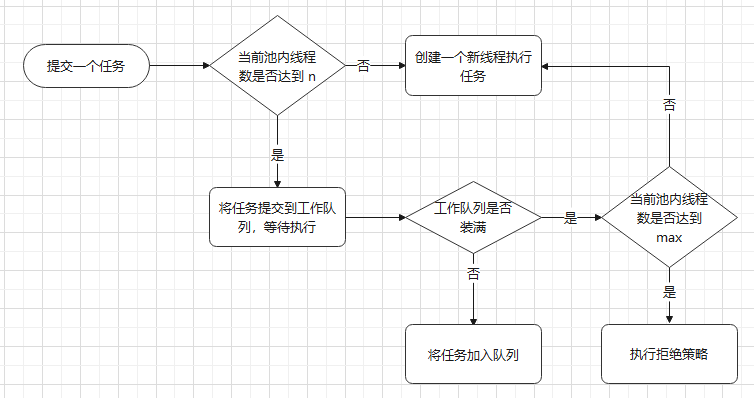
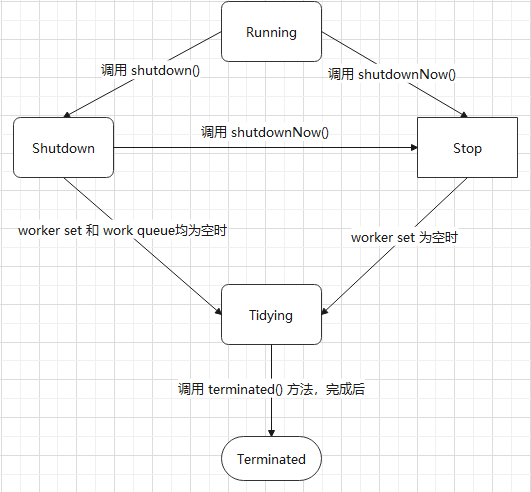
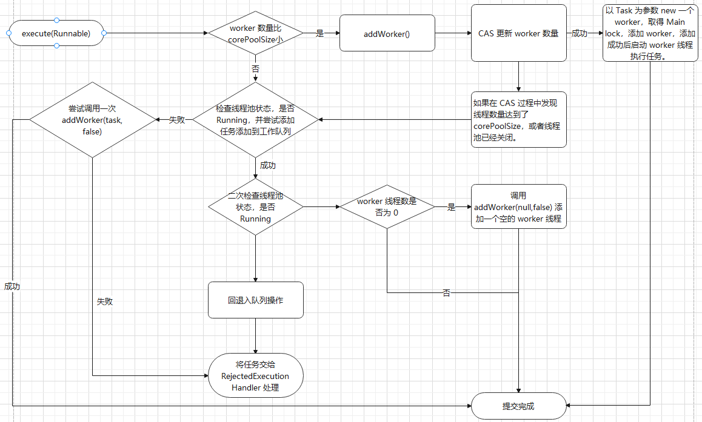

# 线程池

## 1.  池化的意义

能对有限的资源进行统一分配、监控、调优。

特定于`线程池`有以下3个优点：

* 降低资源消耗，不用频繁地创建/销毁线程。
* 提高响应速度，因为使用时大多数情况不用创建线程，而是使用已有的线程。
* 提高线程的可管理性，统一在池内管理。

类似的还有数据库连接池。


## 2. Executors 创建线程池的缺点

Executors 类提供了几种特定的线程池实现，但是他们各有缺点：

* newFixedThreadPool

  使用了`无界队列`作为工作队列(即队列容量为 Integer.MAX_VALUE)，这样会导致线程池内的线程数永远不会超过 coreSize，而且线程池的拒绝策略也会失效，提交任何数量的 task 都不会拒绝，很容易造成工作队列过大而 OOM。

* newSingleThreadExecutor

  只有一个可用线程，相当于单线程顺序执行任务，而且工作队列也是无界队列，缺点和 newFixedThreadPool 类似。

* newCacheThreadPool

  最大线程数为 Integer.MAX_VALUE，会导致大量创建线程，甚至OOM。
  
* newWorkStealingPool

  1.8 新增，主要是创建 Fork/Join Pool。

* newScheduledThreadPool

* newSingleThreadScheduledExecutor


## 3. 使用 ThreadPoolExecutor 创建线程池

### 3.1 构造参数

总共有7个可输入参数：

```java
int corePoolSize					// 核心线程数
int maximumPoolSize					// 最大线程数
long keepAliveTime					// 线程存活时间数值
TimeUnit unit						// 存活时间单位
BlockingQueue<Runnable> workQueue	// 工作队列
ThreadFactory threadFactory			// 线程工厂
RejectedExecutionHandler handler	// 拒绝策略
```

* corePoolSize 核心线程数和 maximumPoolSize 最大线程数

  这两个参数的具体作用参见 [3.2 execute 原理](#3.2 execute 原理)

  

* keepAliveTime 线程存活时间和 unit 存活时间单位

  当前存活的线程数大于 corePoolSize 时，空闲线程的存活时间。而 unit 则是这个时间的单位。

  超过这个时间，且总线程数量大于 corePoolSize，空闲线程将被终止。

  

* workQueue 工作队列

  是一个 BlockingQueue 阻塞队列，JDK 里有一些具体的实现。

  也可以自定义工作队列。

  

* threadFactory 线程工厂

  线程池内部创建线程的工厂，通常使用默认工厂，即 `Executors.defaultThreadFactory()`。

  也可以自定义线程工厂，比如自定义线程创建时的名字，便于日志监控。

  

* handler 拒绝策略

  当工作队列满且线程池内总线程数已达到最大线程数时，继续提交任务会触发拒绝策略，有4种 JDK 内置的策略：

  * `AbortPolicy`  默认策略，直接抛出 `RejectedExecutionException` 异常。
  * `DiscardPolicy`  什么都不做，直接丢弃新提交的任务。
  * `DiscardOldestPolicy`  丢弃工作队列里最早的未执行任务，然后重试提交。
  * `CallerRunsPolicy`  用当前提交任务的线程直接调用 `run` 来执行任务。

  也可以自定义拒绝策略。


### 3.2 工作原理

假设核心线程数为`n`，最大线程数为 `max`：




### 3.3 内部实现分析

​	除了以上7个构造参数，ThreadPoolExecutor 内部还有几个关键的成员：

```java
private final AtomicInteger ctl = new AtomicInteger(ctlOf(RUNNING, 0));  	// 前3位标识线程池状态，后29位表示 worker 线程数量
private final HashSet<Worker> workers = new HashSet<Worker>(); 				// worker 线程集合
```

* 线程池状态

  * RUNNING (-1，即111):  正常运行状态，接收新任务，并且会处理工作队列里的任务。
  * SHUTDOWN (0，即000): 关闭状态，不接受新任务，但是还是会处理工作队列里的任务。
  * STOP (1，即001):     停止状态，不接受新任务，不处理工作队列里的任务，而且会中断所有正在执行的任务。
  * TIDYING (2，即010):  所有任务均已终止，worker set为空，没有存活的 worker 线程，将马上执行 `terminated()`方法。
  * TERMINATED (3, 即011):  `terminated()`方法已执行完毕。
  
  状态转移流程如下图：
  
  
  
* worker 线程

  继承自 `AbstractQueuedSynchronizer`，并实现了 Runnable 接口，所以一个 `Worker` 对象既是一个线程，又是一个同步器。

  

* 提交任务时

  

  

* 执行任务时

  `Worker` 对象内部调用 `runWorker()`方法，如果 `Worker` 在新建时就包含一个 FirstTask，那么执行这个 task，否则使用线程池的 `getTask()` 方法从工作队列中获取一个 task来执行。

  执行 task 前调用 `Worker` 的 `lock()` 方法，`Worker` 实现的同步器是一个互斥的且不可重入的锁，这个不可重入锁可以在调用 tryAcquire() 时准确判断 `Worker` 的运行状态。

  * 返回false，表示有任务在运行。
  * 返回true，表示 `Worker` 处于空闲状态。

  然后判断线程池状态，如果此时线程池为 STOP 状态，就马上中断当前 worker 线程；否则就开始执行 task。
  
  执行 task 其实就是直接调用 task.run()，因为当前已经是 worker 线程，所以相当于是 worker 线程在执行 task 线程的功能，这也就是线程池复用线程资源的体现。

  task 执行完毕后调用 `unlock()`解锁，此时`Worker` 又回到了空闲状态。

  

* 关闭线程池

  有两个关闭方法：

  * `shutdown()` 将线程状态 `clt` 设置为 SHUTDOWN，中断没有执行任务的线程。
  * `shutdownNow()` 将线程状态`clt`设置为STOP，并遍历内部所有线程，将不处于中断状态的线程全部中断，并将 `workQueue` 中剩余的任务放入一个新 List 并返回这个 List。

  当执行了任意一个 shutdown 方法后，`isShutDown()` 将返回 `true`。当所有线程均已关闭，且工作队列为空时，`isTerminated()`返回 `true`。

  需要注意，调用完 `shutdown()`方法后不一定会马上`terminated`，要等待工作队列里的任务全部执行完。

  

## 4. 使用 ScheduledThreadPoolExecutor 创建线程池

​	`ScheduledThreadPoolExecutor` 继承自 `ThreadPoolExecutor`，为任务提供延迟或周期执行，属于线程池的一种。

### 4.1 与 ThreadPoolExecutor 的区别

* 构造参数最多只接受 3 个，核心线程数、ThreadFactory、RejectedExecutionHandler，最大线程数固定为 Integer.MAX_VALUE，存活时间固定为 0，工作队列固定为一个空的 `DelayedWorkQueue`。
* 使用 `ScheduledFutureTask`  执行周期任务，所有任务都被封装为一个 `ScheduledFutureTask`  。

## 5. Fork/Join 框架

## 6. 实战

