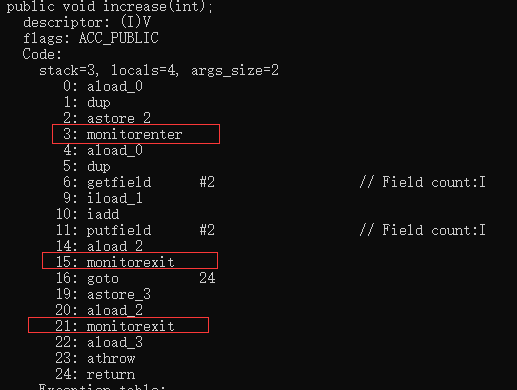

# synchronized 关键字

​	

## 1. 原理分析

​	synchronized 关键字实现线程安全的原理：保证可见性，可重入，互斥锁的加解锁。

* 互斥锁的加解锁

  ```
  private int count = 0;
  
  public void increase(int n){
  	synchronized(this){
  		count += n;
  	}
  }
  ```

  

  用以上代码编译出来的 class 用 `javap -v` 反编译看到的字节码如下：

  

  * monitorenter 指令发生在加锁时，使加锁对象的锁计数器 +1；
  * monitorexit 指令发生在释放锁时，使加锁对象的锁计数器 -1；

  **monitor** 和 **被监视对象（object）**和 **线程** 互相之间只能是 一对一 的绑定关系。

  enter 和 exit 的流程如下图所示：

  


* 可重入

  ​	由上面对 monitor 的描述可知，被监视对象拥有一个锁计数器，每次同一个线程 monitorenter 就 +1，计数器的值就是重入的次数。相对的，每次 monitorexit 就 -1，如果 -1 后计数器不为0，说明当前线程仍持有锁，上次 enter 是一次重入；如果 -1 后计数器为 0，说明当前线程释放了锁，这时其他线程就可以来尝试 monitorenter 了。

  ​	可重入可以让同一个线程在持有当前对象锁的情况下无需等待就可以直接获取当前对象锁，继续执行同步语句，不会造成一个线程在持有一个对象锁时无法再获取同一个对象的锁，导致自己等待自己的死锁形成。

  

* 保证可见性

  根据 Happens-before 原则：对同一个监视器的解锁，happens-before于对该监视器的加锁。

  

## 2. synchronized 优化

​		monitorenter 和 monitorexit 依赖于操作系统的 Mutex Lock来实现，在调用时会切换用户态和内核态，对于运行在单线程上的 synchronized 语句块，可能切换的时间比执行语句还要长，造成严重的性能损失，于是在jdk1.6后对 synchronized 的实现引入了大量的优化来减少锁操作的开销。

​	这些优化属于 JVM 层面的优化，单看反编译字节码是没有变化的。

* 锁消除

  ​	虚拟机的即时编译器在运行时，对一些在代码上写了同步语句的，但是编译器检测到不可能发生共享数据竞争，就会消除该锁，该机制依赖于逃逸分析。

  举例：

  ```java
  String s = s1 + s2 + s3;
  ```

  ​	在 jdk 1.6之前，这里会编译为线程安全的 StringBuffer连续append，而在 jdk1.6 之后由于判断这一行代码不可能发生逃逸，于是会改为非线程安全的 StringBuilder 连续的 append。

  

* 偏向锁

  ​	当一个线程访问同步快并获取锁时，会在对象头和栈帧中的锁记录里存储锁偏向的线程ID，以后该线程在进入和推出同步块时不需要进行CAS操作来加锁和解锁。只需要简单地测试一下对象头的`Mark Word`里是否存储着指向当前线程的偏向锁。

  ​	如果成功，表示线程已经获取到了锁；

  ​	如果失败即偏向锁指向其他线程，会先进行CAS替换存储的线程ID，

  * 替换成功会继续获取偏向锁。
  * 反之 CAS 操作失败，会进行偏向锁撤销，然后锁升级为轻量级锁。

  ​	**偏向锁撤销** 会一直等到竞争出现才会进行，并且要等待原持有偏向锁的线程到达**全局安全点**（即该线程没有正在执行的字节码）时才会暂停原持有偏向锁的线程，并检查持有偏向锁的线程是否活着。

  * 如果活着，且未退出同步块，就会升级为轻量级锁。
  * 如果活着，但已退出同步块，会遍历栈帧替换线程ID偏向其他线程，或者设置为无锁状态。
  * 如果不处于活动状态，也会遍历栈帧替换线程ID偏向其他线程，或者设置为无锁状态。

  

* 轻量级锁

  ​	轻量级锁，用于在无实际竞争但有多个线程使用同步块的情况，减少重量级锁在线程阻塞时造成的线程开销。轻量级锁定情况下 Mark Word 中锁标志位置为 00。

  ​	轻量级锁不需要申请互斥量，只需要 CAS 替换对象头中的锁记录，锁记录存储于线程的虚拟机栈中。

  * 如果 CAS 成功，当前线程就获取了锁，Mark Word 中存储的数据为指向锁记录的指针。

  * 如果 CAS 失败，先检查当前 Mark Word 中是否存在指向当前线程栈的指针。
    * 如果有，说明已获取锁，可以直接调用。
    * 否则说明可能存在竞争，此时会尝试自旋获取锁，如果自旋 一段时间还是不能获取锁，说明竞争比较激烈，此时会升级为重量级锁。

  

* 锁粗化

  ​	绝大多数情况下，锁的粒度都是越小越好，比如 synchronized 同步块包括的代码范围越小，需要执行的同步操作越少，其他等待锁的线程可以尽早地获取锁。

  ​	但是如果存在连续的一系列操作都是对同一个对象反复加锁/解锁，或者同步块出现在循环体中时，频繁加解锁会造成不必要的额外开销，这时，JVM 会将锁范围**粗化**到连续操作的外部。

  

* 自适应自旋锁

  ​	自旋锁是为了降低频繁挂起和恢复阻塞线程带来的性能开销，因为大多数共享数据的锁定状态持续时间很短，此时可以让等待线程执行一个忙循环，等待一小段时间再去尝试获取锁，而不用挂起，这就是自旋锁。

  ​	从 JDK 1.4 开始就有自旋锁，直到 JDK 1.6 才默认打开，默认自旋次数为 10，可通过 `-XX:PreBlcokSpin` 参数来更改自旋次数。

  ​	JDK 1.6 后引入了自适应自旋锁，增加了自旋次数和是否使用自旋的灵活性，JVM会根据前一次在同一个锁上的自旋时间及当前锁拥有者的状态决定。

  * 如果上次自旋获得过锁，JVM会适当增加自旋次数，以期用自旋锁再次获得锁。
  * 如果上次自旋失败，JVM可能会取消掉自旋过程，直接挂起。


## 3. 锁升级

​	锁升级的大致流程：


以上图片来自于 https://blog.dreamtobe.cn/2015/11/13/java_synchronized/


## 4. 不同锁的对比

| 类型     | 适用场景                   | 升级场景                                      | 与下一级比较的优势                      | 缺点                                                         |
| -------- | -------------------------- | --------------------------------------------- | --------------------------------------- | ------------------------------------------------------------ |
| 无锁     | JVM判断不存在共享数据竞争  | 即时编译器判断有额外的线程可能访问同步块      | 最快的执行时间                          | \                                                            |
| 偏向锁   | 实际只有一个线程访问同步块 | 有第二个线程访问同步块，且第一次 CAS 替换失败 | 最多只有一次CAS，与无锁比时间差距仅ns级 | 偏向锁撤销会有较大开销                                       |
| 轻量级锁 | 竞争很少时，响应时间短     | 竞争激烈时，有一个线程自旋多次仍获取不到锁    | 没有挂起/恢复操作，不需要切换用户态     | 竞争激烈时，自旋会消耗CPU性能                                |
| 重量级锁 | 竞争激烈时，保证吞吐量     | \                                             | \                                       | 频繁地加解锁会导致操作系统频繁地切换用户态和内核态，造成很大的性能开销 |


## 5. synchronized 与 ReentrantLock 比较

​	这里只列出不同点中各自的**优点**：

* synchronized：
  * 基于JVM实现，简单易用，性能上与 ReentrantLock 基本没有差距。
  * JVM针对 synchronized 有许多优化，如锁粗化、锁消除等。
* ReentrantLock：
  * 可以选择公平锁还是非公平锁。
  * 可以在尝试获取锁时中断或设置超时时间，避免死锁。
  * 可以通过 Condition 设置更灵活的锁条件。
  * 可以通过 tryLock() 的返回值判断是否获取到锁。

